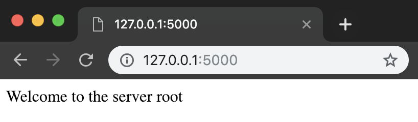

# Adding a New Path

## The story so far

At this point, you should have a server that you can run with `flask run`.

```bash
flask run
 * Environment: production
   WARNING: Do not use the development server in a production environment.
   Use a production WSGI server instead.
 * Debug mode: off
 * Running on http://127.0.0.1:5000/ (Press CTRL+C to quit)
```

Let's dive a little deeper into what Flask just told us:

* `line 1`: This is the command to start your Flask server. When you run this command, in the same directory as your `app.py`, it will start running Flask for you.
* `lines 2-5`: You can ignore these for now. They become important later, when you are getting ready to run your server on the Internet.
* `line 6`: This line is important. It tells you how to access your server!
  * See the URL there, `http://127.0.0.1:5000/`? That looks different than URLs you are familiar with. Here are its parts:
  * `http://`: We've seen this before, it's the `protocol`. You can ignore it for now.
  * `127.0.0.1`: This is an `ip address`. Every website has one, but you don't see it because it's masked by a `domain name`. This specific `ip address` is special. We'll talk more about this address in a moment.
  * `:5000`: This is a `port`. When you're accessing a website on the internet, you don't need to specify the `port`. By default, `HTTP` uses a default port of `80`. However, Flask uses port `5000` by default, so we'll need to specify it in our URL.
  * `/`: Lastly, this is the path. A single `/` has a special name. It's called the `root path`.

Currently, you can only access your server if you type `http://127.0.0.1:5000/say_hello` into your browser. If you try to access your server at the `root path`, you'll get a `404 Not Found`.

Can you guess why?

Let's look back at our `app.py`, this time without any of the code comments:



```python
from flask import Flask

app = Flask(__name__)

@app.route('/say_hello') # this is the only path our server understands
def hello():
    return 'Hello, World!'
```



Notice on `line 5`, we've written the `@app.route()` with our `/say_hello` `path` as an `argument`.

If we want to access our server at the `root path`, we'll have to tell Flask how to do it.



```python
from flask import Flask

app = Flask(__name__)

@app.route('/say_hello')
def hello():
    return 'Hello, World!'

# new code below
@app.route('/')
def index():
    return 'Welcome to the server root'
```



Add the new code to your `app.py` and then save your file.


While it may be tempting to copy and paste code from this page into your `app.py` file, you will likely find that you learn more by typing the code in yourself. Avoid copy-pasting, as it can lead to a bunch of code that you depend on, but don't understand.


We've added the new path, but it won't work yet. Our server is running in `production mode`, so it needs to be restarted in order to start using our new code.

Go back to your terminal and press `CTRL+C` , that is `control` then `c`, to quit your server. Then, restart it with `flask run`.

Once your server starts running, you should be able to access it at the `root path`: `/`.



Notice that the text we see on the screen is the same as the `string` that we `return` in our `functions` `hello`, and `index`. This is because Flask will take the string that we `return` and convert it into an `HTTP` `response` that your web browser understands. Thanks, Flask!


Now that you know how to add paths and modify the `HTTP response`, it's a great time to experiment. Try adding yet another path. Can you make `Look! A pretty kitty cat!` appear in your browser? Try returning some HTML, like this: `return '<h1>This is HTML</h1>'`. How does that change what you see in the browser?



Once you can access your server at the `root path`, you're ready to move on.



